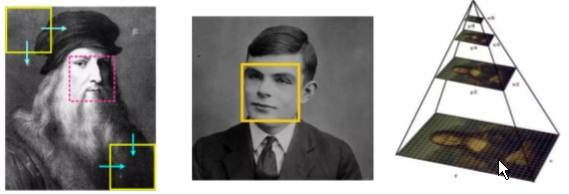
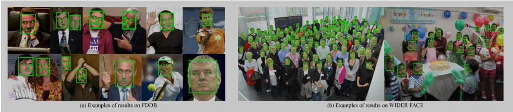
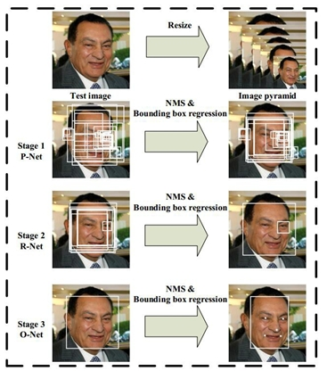
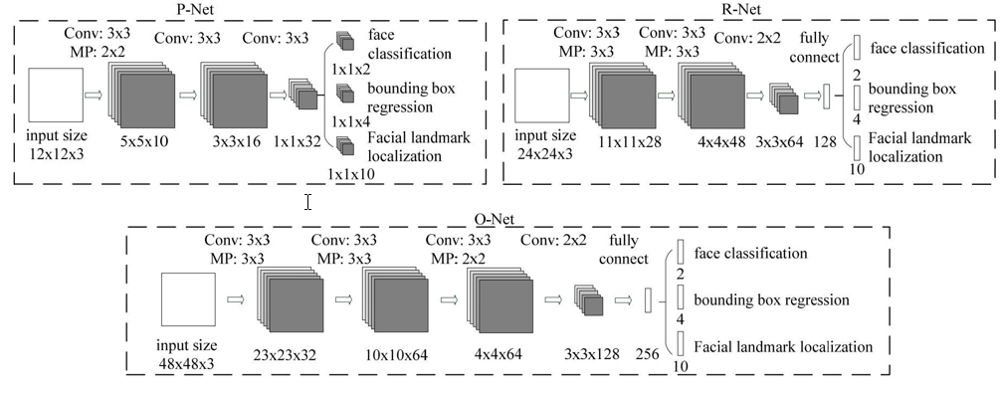
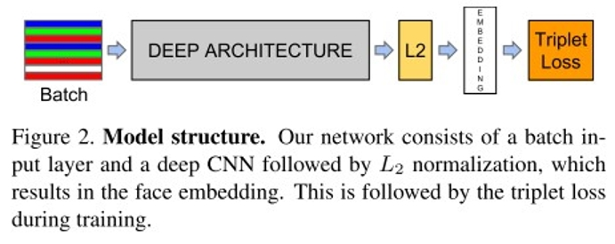
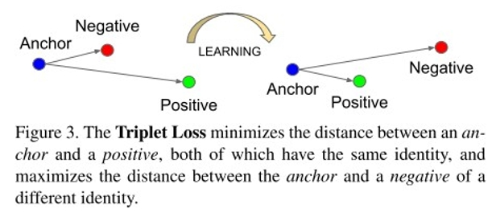
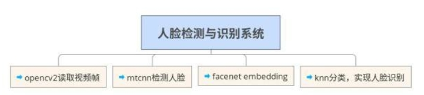

### 一、人脸识别发展介绍——从⾮非深度到深度 传统的⼈人脸
检测器器:Viola和Jones于CVPR2001发表的《Robust Real-time Object Detection》

⾮非深度⽅方法的检测效果 

 **优点：**简单，快速。 

 **缺点：**⼈人脸检测效果不不好。如图所示，正 ⾯面/垂直/光线较好的⼈人脸，该⽅方法可以检 测出来，⽽而侧⾯面/歪斜/光线不不好的⼈人脸， ⽆无法检测。因此，该⽅方法不不适合现场应 ⽤用。

1. face++(0.9950)

 参考⽂文献：Naive-Deep face Recognition: Touching the Limit of LFW Benchmark or Not?

 face++从⽹网络上搜集了了5million张⼈人脸图⽚片⽤用于训练深度卷积神经⽹网络模型，在 LFW数据集上准确率⾮非常⾼高。该篇⽂文章的⽹网路路模型很常规（常规深度卷积神经⽹网络模型）

2. DeepFace（0.9735 ）

 参考⽂文献：Deepface: Closing thegap to humal-level performance in face verification

常规⼈人脸识别流程是：⼈人脸检测-对⻬齐-表达-分类。本⽂文中，我们通过额外的3d模型 改进了了⼈人脸对⻬齐的⽅方法。然后，通过基于4million⼈人脸图像（4000个个体）训练的⼀一个9层的⼈人⼯工神经⽹网络来进⾏行行⼈人脸特征表达。我们的模型在LFW数据集上取得了了0.9735的准确率。该⽂文章的亮点有以下⼏几点：⼀一，基于3d模型的⼈人脸对⻬齐⽅方法；⼆二，⼤大数据训练的⼈人⼯工神经⽹网络。

3. FR+FCN（0.9645 ）

参考⽂文献：Recover Canonical-View Faces in the Wildwith Deep NeuralNetworks

⾃自然条件下，因为⻆角度，光线，occlusions（咬合/张⼝口闭⼝口），低分辨率等原因，使⼈人脸图像在个体之间有很⼤大的差异，影响到⼈人脸识别的⼴广泛应⽤用。本⽂文提出了了⼀一种新的深度学习模型，可以学习⼈人脸图像看不不⻅见的⼀一⾯面。因此，模型可以在保持个体之间的差异的同时，极⼤大的减少单个个体⼈人脸图像（同⼀一⼈人，不不同图⽚片）之间的差异。与当前使⽤用2d环境或者3d信息来进⾏行行⼈人脸重建的⽅方法不不同，该⽅方法直 接从⼈人脸图像之中学习到图像中的规则观察体（canonical    view，标准正⾯面⼈人脸图像）。作者开发了了⼀一种从个体照⽚片中⾃自动选择/合成canonical-view的⽅方法。在应⽤用⽅方⾯面，该⼈人脸恢复⽅方法已经应⽤用于⼈人 脸核实。同时，该⽅方法在LFW数据集上获得了了当前最好成绩。该⽂文章的亮点在于：⼀一，新的检测/选择 canonical-view的⽅方法；⼆二，训练深度神经⽹网络来重建⼈人脸正⾯面标准图⽚片（canonical-view）。

4. DeepID（0.9745 ）

参考⽂文献：DeepID3: Face Recognition with Very Deep NeuralNetworks

深度学习在⼈人脸识别领域的应⽤用提⾼高了了⼈人脸识别准确率。本⽂文中，我们使⽤用了了两种 深度神经⽹网络框架（VGG net和GoogleLeNet）来进⾏行行⼈人脸识别。两种框架 ensemble结果在LFW数据集上可以达到0.9745的准确率。⽂文章获得⾼高准确率主要归功于⼤大量量的训练数据，⽂文章的亮点仅在于测试了了两种深度卷积神经⽹网络框架。

5. FaceNet(0.9963)

 参考⽂文献：FaceNet: A UnifiedEmbedding for Face Recognition and Clustering

作者开发了了⼀一个新的⼈人脸识别系统：FaceNet，可以直接将⼈人脸图像映射到欧⼏几⾥里里 得空间，空间的距离代表了了⼈人脸图像的相似性。只要该映射空间⽣生成，⼈人脸识别，验证和聚类等任务就可以轻松完成。该⽅方法是基于深度卷积神经⽹网络，在LFW数据集上，准确率为0.9963，在YouTube Faces DB数据集上，准确率为0.9512。 FaceNet的核⼼心是百万级的训练数据以及 triplet  loss。

6. baidu的⽅方法

参考⽂文献：Targeting UltimateAccuracy : Face Recognition via Deep Embedding

本⽂文中，作者提出了了⼀一种两步学习⽅方法，结合mutil-patchdeep CNN和deep metric    learning，实现脸部特征提取和识别。通过1.2million（18000个个体）的训练集训练，该⽅方法在LFW数据集上取得了了0.9977的成绩。

7. pose shape expression augmentation（0.9807）

参考⽂文章：Do We ReallyNeed to CollectMillions of Faces forEffective Face Recognition

该⽂文章的主要思路路是对数据集进⾏行行扩增（data augmentation）。CNN深度学习模型，⽐比如 face++，DeepID，FaceNet等需要基于百万级⼈人脸图像的训练才能达到⾼高精度。⽽而搜集百万级⼈人脸数据所耗费的⼈人⼒力力，物⼒力力，财⼒力力是很⼤大的，所以商业公司使⽤用的图像数据库是不不 公开的。本⽂文中，采⽤用了了新的⼈人脸数据扩增⽅方法。对现有公共数据库⼈人脸图像，从pose，shape和expression三个⽅方⾯面合成新的⼈人脸图像，极⼤大的扩增数据量量。在LFW和IJB-A数据 集上取得了了和百万级⼈人脸数据训练⼀一样好的结果。该⽂文章的思路路很好，很适合普通研究者。

 8. CNN-3DMM estimation(0.9235)

参考⽂文献：Regressing Robust andDiscriminative 3D Morphable Models with a very Deep Neural Network

当在真实场景中应⽤用3d模拟来增加⼈人脸识别精度，存在两类问题：要么3d模拟不不稳定，导致 同⼀一个个体的3d模拟差异较⼤大；要么过于泛化，导致⼤大部分合成的图⽚片都类似。因此，作者研究了了⼀一种鲁棒的三维可变⼈人脸模型（3D morphable face models (3DMM)）⽣生成⽅方法。他们 采⽤用了了卷积神经⽹网络（CNN）来根据输⼊入照⽚片来调节三维⼈人脸模型的脸型和纹理理参数。该⽅方法 可以⽤用来⽣生成⼤大量量的标记样本。该⽅方法在MICC数据集上进⾏行行了了测试，精确度为state of the art 。与3d-3d⼈人脸⽐比对流程相结合，作者在LFW，YTF和IJB-A数据集上与当前最好成绩持 平。⽂文章的关键点有两个：⼀一，3D重建模型训练数据获取；⼆二，3D重建模型训练   。

9. DenseBox做⼈人脸检测

参考⽂文献：DenseBox: Unifying Landmark Localization withEnd to EndObject Detection

DenseBox是⼀一个典型的基于全卷积⽹网络的⽬目标检测器器，其通过 FCN得到待检测⽬目 标的热度图，然后根据热度图来获得⽬目标的位置和⼤大⼩小，这给⽬目标检测⼜又提供了了⼀一种新的问题解决思路路。

10. 基于CNN的⼈人脸检测器器 —— FacenessNet

 参考⽂文献：Faceness-Net: Face Detection throughDeep Facial Part Responses

FacenessNet是专⻔门针对⼈人脸设计的⼀一个检测器器，其考虑了了头发、眼睛、⿐鼻⼦子、嘴 巴和胡⼦子这五个脸部特征，简单地说，对于⼀一个候选窗⼝口，FacenessNet    先分析这五个部分是否存在，然后再进⼀一步判断是不不是⼀一张⼈人脸。

### 二、 人脸识别的难点 

1. ⽤用户配合度

 现有的⼈人脸识别系统在⽤用户配合、采集条件⽐比较理理想的情况下可以取得令⼈人满意的 结果。但是，在⽤用户不不配合、采集条件不不理理想的情况下，现有系统的识别率将陡然下降。⽐比如，⼈人脸⽐比对时，与系统中存储的⼈人脸有出⼊入，例例如剃了了胡⼦子、换了了发型、多了了眼镜、变了了表情都有可能引起⽐比对失败。也就是说，⼈人如果发⽣生较⼤大变化，系 统可能就会认证失败。光照、姿态、装饰等，对机器器识别⼈人脸都有影响

2.相似性

 不不同个体之间的区别不不⼤大，所有的⼈人脸的结构都相似，甚⾄至⼈人脸器器官的结构外形都 很相似。这样的特点对于利利⽤用⼈人脸进⾏行行定位是有利利的，但是对于利利⽤用⼈人脸区分⼈人类 个体是不不利利的。

3.易易变性

⼈人脸的外形很不不稳定，⼈人可以通过脸部的变化产⽣生很多表情，⽽而在不不同观察⻆角度，⼈人脸的视觉图像也相差很⼤大，另外，⼈人脸识别还受光照条件（例例如⽩白天和夜晚，室内和室外等）、⼈人脸的很多遮盖物（例例如⼝口罩、墨墨镜、头发、胡须等）、年年龄等多⽅方⾯面因素的影响。在⼈人脸识别中，第⼀一类的变化是应该放⼤大⽽而作为区分个体的标准 的，⽽而第⼆二类的变化应该消除，因为它们可以代表同⼀一个个体。通常称第⼀一类变化 为类间变化（inter-class difference），⽽而称第⼆二类变化为类内变化（intra-class difference）。对于⼈人脸，类内变化往往⼤大于类间变化，从⽽而使在受类内变化⼲干扰 的。

### 三、 人脸识别的评测⽅方法

1. LFW数据集（LabeledFaces in the Wild）

⽬目前⽤用得最多的⼈人脸图像数据库。该数据库共13，233幅图像，其中5749个⼈人， 其中1680⼈人有两幅及以上的图像，4069⼈人只有⼀一幅图像。图像为250*250⼤大⼩小的 JPEG格式。绝⼤大多数为彩⾊色图，少数为灰度图。该数据库采集的是⾃自然条件下⼈人

脸图⽚片，⽬目的是提⾼高⾃自然条件下⼈人脸识别的精度。

2. LFW6种评价标准：

- Unsupervised；
-  Image-restricted with no outside data；
-  Unrestricted with no outside data；
-  Image-restricted with label-freeoutside data；
- Unrestricted with label-free outside data；  
- Unrestricted with labeled outside data.

⽬目前，⼈人⼯工在LFW数据集上的准确率在0.9427~0.9920。在该数据集的第六种评价 标准下（⽆无限制，可以使⽤用外部标注的数据），许多⽅方法已经赶上（超过）⼈人⼯工识别精度，⽐比如face++,DeepID3，FaceNet等。

当前⼤大部分模型的准确度表：[http://vis-www.cs.umass.edu/lfw/results.html](http://vis-www.cs.umass.edu/lfw/results.html)

### 四、 重点⼏几种模型的原理理讲解（MTCNN/FaceNet（OpenFace）） 

1. MTCNN

 参考⽂文献：Joint Face Detection and Alignment usingMulti-task Cascaded Convolutional Networks

**stage1:    **在构建图像⾦金金字塔的基础上，利利⽤用fully convolutional network来进⾏行行检测，同时利利⽤用 boundingbox regression 和 NMS来进⾏行行修**正。**

▸ **stage2: **将通过stage1的所有窗⼝口输⼊入作进⼀一步 判断，同时也要做boundingboxregression 和 NMS。

▸ **stage3: **和stage2相似，只不不过增加了了更更强的约 束：5个⼈人脸关键点。

**FACENET**

FaceNet是⼀一个通⽤用的系统，可以⽤用于⼈人脸验证（是否是同⼀一⼈人？），识别（这个

⼈人是谁？）和聚类（寻找类似的⼈人？）。FaceNet采⽤用的⽅方法是通过卷积神经⽹网络

学习将图像映射到欧⼏几⾥里里得空间。空间距离直接和图⽚片相似度相关：同⼀一个⼈人的不不 同图像在空间距离很⼩小，不不同⼈人的图像在空间中有较⼤大的距离。只要该映射确定下 来，相关的⼈人脸识别任务就变得很简单。

模型结构

**FACENET**

### 五、 TensorFlow实现的MTCNN+FaceNet的⼈人脸检测 

1.采⽤用opencv2读取图⽚片；

▸   2.对图⽚片采⽤用mtcnn⽅方法，检测⼈人脸；

▸ 3. 采⽤用预训练的facenet对检测的⼈人脸进⾏行行embedding，embedding成128维度的特征；

▸   4. 对⼈人脸embedding特征采⽤用knn进⾏行行分类，实现⼈人脸识别；

### 六、 推荐的开源的⼈人脸检测项⽬目

1. 中科院⼭山世光⽼老老师的SeetaFaceEngine https://github.com/seetaface/ SeetaFaceEngine
2. CMU的OpenFace [http://cmusatyalab.github.io/openface/](http://cmusatyalab.github.io/openface/)

