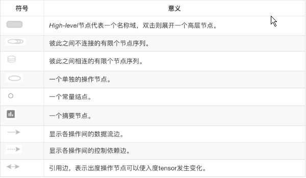

### 一、可视化

TensorBoard 涉及到的运算，通常是在训练庞大的深度神经网络中出现的复杂而又难以理解的运算。为了更方便 TensorFlow 程序的理解、调试与优化，发布了一套叫做 TensorBoard 的可视化工具

**数据序列化-events文件**

TensorBoard 通过读取 TensorFlow 的事件文件来运行。TensorFlow 的事件文件包括了你会在 TensorFlow 运行中涉及到的主要数据。

```
tf.summary.FileWriter('./turing/', graph=default_graph)
```

**启动TensorBoard**

```
tensorboard --logdir=path/to/log-directory
tensorboard --logdir="C:\Users\TuringEmmy\Desktop\MachineLearning\TensorFlowStudy\tensorflow03\summary"
```

**节点符号**



**添加节点汇总操作**

tensorboard还提供了另外重要的功能，那就是追踪程序中的变量以及图片相关信息，也就是可以一直观察程序中的变量值的变化曲线首先在构建计算图的时候一个变量一个变量搜集，构建完后将这些变量合并然后在训练过程中写入到事件文件中。

| 方法                     | 说明                |
| ---------------------- | ----------------- |
| tf.summary.scalar()    | 收集对于损失函数和准确率等单值变量 |
| tf.summary.histogram() | 收集高维度的变量参数        |
| tf.summary.image()     | 收集输入的图片张量能显示图片    |

### 二、线性回归的原理

```python
1. 准备好1特征和1目标值 100[100,1]
            y=x*0.7 + 0.8
2. 建立模型 随机初始化准备一个权重w,一个偏置信b
        y_predict = x*w + b(模型的参数必须用该变量定义)
3. 求损失函数，误差
loss误差   (y_1-y_1')^2+...+(y_100-y_100')^2   /  100
4. 梯度下降去优化损失过程  指定学习率

矩阵相乘：(m行, n行)  (n行, 1)  (m行, 1)   +    bias

# 均镇运算：
tf.matmul(x,w)
# 平方：
tf.square(error)
# 梯度下降：
tf.train.AdagradOptimizer(learning_rate=0.3)
```


### 三、trainable学习率的调整, 梯度爆炸

```python
with tf.Session() as session:
    session.run(init_op)
    print('随机初始化的参数权重:%f, 偏置为%f'%(weight.eval(), bias.eval()))

    # 建立事件文件
    filewrite = tf.summary.FileWriter('./trainable/',graph=session.graph)
    tensorflow03手写识别softmax

    for i in range(500):
        session.run(train_op)
        print('第%d次随机初始化的参数权重:%f, 偏置为%f' % (i, weight.eval(), bias.eval()))
```


### 四、增加损失值等变量显示

```python
# 收集tensor
tf.summary.scalar("losses", loss)  # losses是在后台进行显示的
tf.summary.histogram("weights", weight)
...
summary = session.run(merged)  
```


### 五、模型的保存

模型的保存和恢复是通过tf.train.Saver类去实现，它主要通过将Saver类添加OPS保存和恢复变量到checkpoint

**保存**

保存模型需要调用Saver.save()方法。save(sess, save_path, global_step=None)，checkpoint是专有格式的二进制文件，将变量名称映射到张量值。

```python
a = tf.Variable([[1.0,2.0]],name="a")
b = tf.Variable([[3.0],[4.0]],name="b")
c = tf.matmul(a,b)

saver=tf.train.Saver()
with tf.Session() as sess:
    tf.global_variables_initializer().run()
    print(sess.run(c))
    saver.save(sess, '/turing')
```

在多次训练的时候可以指定多少间隔生成检查点文件

```python
saver.save(sess, '/turing', global_step=0) ==> filename: 'matmu-0'

saver.save(sess, '/turing', global_step=1000) ==> filename: 'matmu-1000'
```

**恢复**

恢复模型的方法是restore(sess, save_path)，save_path是以前保存参数的路径，我们可以使用tf.train.latest_checkpoint来获取最近的检查点文件(也恶意直接写文件目录)

```python
a = tf.Variable([[1.0,2.0]],name="a")
b = tf.Variable([[3.0],[4.0]],name="b")
c = tf.matmul(a,b)

saver=tf.train.Saver(max_to_keep=1)
with tf.Session() as sess:
    tf.global_variables_initializer().run()
    print(sess.run(c))
    saver.save(sess, '/turing')

    # 恢复模型
    model_file = tf.train.latest_checkpoint('/turing')
    saver.restore(sess, model_file)
    print(sess.run([c], feed_dict={a: [[5.0,6.0]], b: [[7.0],[8.0]]}))
```

### 六、自定义命令行

**tf.app.run()**, 默认调用main()函数，运行程序。main(argv)必须传一个参数。

**tf.app.flags**, 它支持应用从命令行接受参数，可以用来指定集群配置等。在tf.app.flags下面有各种定义参数的类型

- DEFINE_string(flag_name, default_value, docstring)
- DEFINE_integer(flag_name, default_value, docstring)
- DEFINE_boolean(flag_name, default_value, docstring)
- DEFINE_float(flag_name, default_value, docstring)

第一个也就是参数的名字，路径、大小等等。第二个参数提供具体的值。第三个参数是说明文档

**tf.app.flags.FLAGS**,在flags有一个FLAGS标志，它在程序中可以调用到我们前面具体定义的flag_name.

```python
import tensorflow as tf

FLAGS = tf.app.flags.FLAGS

tf.app.flags.DEFINE_string('data_dir', '/turing',
                           """数据集目录""")
tf.app.flags.DEFINE_integer('max_steps', 2000,
                            """训练次数""")
tf.app.flags.DEFINE_string('summary_dir', '/turing',
                           """事件文件目录""")


def main(argv):
    print(FLAGS.data_dir)
    print(FLAGS.max_steps)
    print(FLAGS.summary_dir)
    print(argv)


if __name__=="__main__":
    tf.app.run()
```