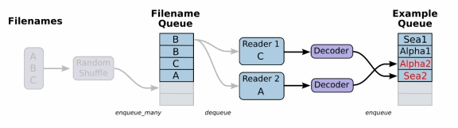

### 一、tensorflow解决读取数据，实现同步模拟

> 在使用TensorFlow进行异步计算时，队列是一种强大的机制。

TensorFlow提供了两个类来帮助多线程的实现：tf.Coordinator和 tf.QueueRunner。Coordinator类可以用来同时停止多个工作线程并且向那个在等待所有工作线程终止的程序报告异常，QueueRunner类用来协调多个工作线程同时将多个张量推入同一个队列中。

**队列概述**

队列，如FIFOQueue和RandomShuffleQueue，在TensorFlow的张量异步计算时都非常重要。

例如，一个典型的输入结构：是使用一个RandomShuffleQueue来作为模型训练的输入：

- 多个线程准备训练样本，并且把这些样本推入队列。
- 一个训练线程执行一个训练操作

| class       | detail              |
| ----------- | ------------------- |
| QueueRunner | 创建一组线程              |
| Coordinator | 帮助多个线程协同工作，多个线程同步终止 |

> QueueRunner类会创建一组线程， 这些线程可以重复的执行Enquene操作， 他们使用同一个Coordinator来处理线程同步终止。此外，一个QueueRunner会运行一个closer thread，当Coordinator收到异常报告时，这个closer thread会自动关闭队列。

关于Coordinate类看来帮助多个线程协同工作，多个线程同步终止，需要代码操控

| methods      | detail          |
| ------------ | --------------- |
| should_stop  | 如果线程应该停止则返回True |
| request_stop | 请求该线程停止         |
| join         | 等待被指定的线程终止      |

注意：如果不手动关闭线程，代码执行完毕，Session关闭，资源已经没有了，而这个时候先成还会自动运行

```python
# 1. 首先定义队列
Q = tf.FIFOQueue(3, tf.float32)
# 放入一些数据
enq_manny = Q.enqueue_many([[0.1, 0.2, 0.3],])
# 2. 定义一些处理数据，取数据的过程，+1,再入队列
out_q = Q.dequeue()  # 这个数据是op
data = out_q + 1
en_q = Q.enqueue(data)

with tf.Session()  as session:
    # 初始化队列
    session.run(enq_manny)
    # 模拟处理数据
    for i in range(100):
        session.run(en_q)
    # 训练数据
    for i in range(Q.size().eval()):  # Q.size是一个op哦，所哟的使用eval
        print(session.run(Q.dequeue()))
```

### 二、队列管理器和协程协调器实现异步读取训练

```python
qr = tf.train.QueueRunner(Q, enqueue_ops=[en_q] * 4)  # 返回队列管理器队列
...
# 真正开启子线程
threads = qr.create_threads(session, start=True)
```

### 三、文件读取流程

1. 构造一个文件队列[将文件的路径+名字]加入队列
2. 构造文件阅读器读取对垒内容,解码
3. 读取队列内容[一个样本内容哦]
4. 批处理

**小数量数据读取**

```python
training_data = ...
with tf.Session():			# 1.存储在常数中  2. 存储在变量中，初始化后，永不改变的值
  input_data = tf.constant(training_data)			
```

要改为使用变量的方式，就需要在数据流图建立后初始化这个变量

```python
training_data = ...
with tf.Session() as sess:
  data_initializer = tf.placeholder(dtype=training_data.dtype,
                                    shape=training_data.shape)
  input_data = tf.Variable(data_initalizer, trainable=False, collections=[])
  lections=[])
  ...
  sess.run(input_data.initializer,
           feed_dict={data_initializer: training_data})
 
```

设定trainable=False可以防止该变量被数据流图的GraphKeys.TRAINABLE_VARIABLES收集，这样我们就不会在训练的时候尝试更新它的值;设定collections=[]可以防止GraphKeys.VARIABLES收集后做为保存和恢复的中断点。设定这些标志，是为了减少额外的开销

**文件读取**



TensorFlow提供了TFRecord格式，二进制数据和训练类别标签数据存储在同一文件。模型训练前图像等文本信息转换为TFRecord格式。TFRecord文件是protobuf格式。数据不压缩，可快速加载到内存。TFRecords文件包含 tf.train.Example protobuf，需要将Example填充到协议缓冲区，将协议缓冲区序列化为字符串，然后使用该文件将该字符串写入TFRecords文件。

**数据读取**

文件队列生成函数：tf.train.string_input_producer(string_tensor, num_epochs=None, shuffle=True, seed=None, capacity=32, name=None)

文件阅读器类：

| 阅读器类                        | 解释                   |
| --------------------------- | -------------------- |
| tf.TextLineReader           | 阅读文本文件逗号分隔值（CSV）格式   |
| tf. FixedLengthRecordReader | 要读取每个记录是固定数量字节的二进制文件 |
| tf.TFRecordReader           | 读取TfRecords文件        |

解码：由于从文件中读取的是字符串，需要函数去解析这些字符串到张量

- tf.decode_csv（records，record_defaults,field_delim = None，name = None）将CSV转换为张量，与tf.TextLineReader搭配使用
- tf.decode_raw（bytes，out_type,little_endian = None，name = None） 将字节转换为一个数字向量表示，字节为一字符串类型的张量,与函数tf.FixedLengthRecordReader搭配使用

**生成文件队列**

将文件名列表交给tf.train.string_input_producer函数

### 四、csv文件读取案例

```python
def csvread(filelist):
    file_queue = tf.train.string_input_producer(filelist)
    reader = tf.TextLineReader()
    key, value = reader.read(file_queue)
    records = [[1], [1], [1], [1]]
    col1, col2, col3, col4 = tf.decode_csv(value, record_defaults=records)
    id_batch, city_batch, province_batch, cost_batch = tf.train.batch([col1, col2, col3, col4], batch_size=10,
                                                                      num_threads=6, capacity=9)
    return id_batch, city_batch, province_batch, cost_batch


if __name__ == '__main__':
    file_name = os.listdir("./csvfile/")
    filelist = [os.path.join("./csvfile/", file) for file in file_name]
    id, city, province, cost = csvread(filelist=filelist)
    with tf.Session() as session:
        coord = tf.train.Coordinator()
        threads = tf.train.start_queue_runners(session, coord=coord)
        print(session.run([id, city, province, cost]))
        print("*" * 100)
        coord.request_stop()
        coord.join(threads=threads)
```

