### 一、感知机模型

神经元也叫做感知器。

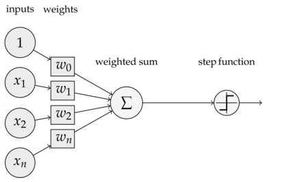

可以看到，一个感知器有如下组成部分：

- 输入权值，一个感知器可以有多个输入`x1`,`x2`,`x3`...`xn`,每个输入上有一个权值`wi`
- 激活函数，感知器的激活函数有许多选择，以前用的是阶跃函数，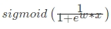其中`z`为权重数据积之和
- 输出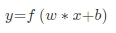

### 二、神经网络结构

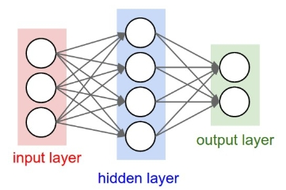

神经网络其实就是按照一定规则连接起来的多个神经元。

- 输入向量的维度和输入层神经元个数相同
- 第N层的神经元与第N-1层的所有神经元连接，也叫 **全连接**
- 上图网络中最左边的层叫做输入层，负责接收输入数据；最右边的层叫输出层，可以有多个输出层。我们可以从这层获取神经网络输出数据。输入层和输出层之间的层叫做隐藏层，因为它们对于外部来说是不可见的。
- 而且同一层的神经元之间没有连接
- 并且每个连接都有一个权值，

那么我们以下面的例子来看一看，图上已经标注了各种输入、权重信息

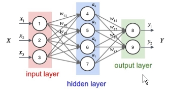

对于每一个样本来说，我们可以得到输入值`x1`,`x2`,`x3`,也就是节点1，2，3的输入值，那么对于隐层每一个神经元来说都对应有一个偏置项`b`，它和权重一起才是一个完整的线性组合

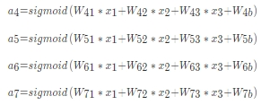

**矩阵表示**

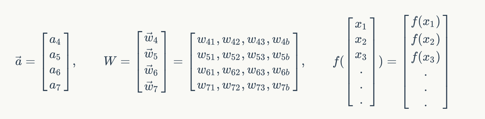

**神经网络训练**

1. 前向传播

神将网络的训练类似于线性回归中的训练优化过程。关于梯度下降可以分为以下几步

- 计算结果误差
- 通过梯度下降找到误差最小
- 更新权重以及偏置项

> 这样可以得出每一个参数在进行一次计算结果之后，**通过特定的数学理论优化误差后会得出一个变化率α**

2. 反向传播

通过误差最小得到新的权重等信息，然后更新整个网络参数。通常会指定学习的速率`λ`（超参数），通过 **变化率和学习速率** 率乘积，得出各个权重以及偏置项在一次训练之后变化多少，以提供给第二次训练使用

**神经网络接口**

在使用梯度下降时候，一般需要指定学习速率

```
tf.train.GradientDescentOptimizer(0.5)
```

| method     | 说明             |
| ---------- | -------------- |
| `__init__` | 构造一个新的梯度下降优化器  |
| `minimize` | 添加操作以更新最小化loss |

### 三、简单的神经网络实现手写数字图片识别
mnist数据集 **http://yann.lecun.com/exdb/mnist/**

55000行的训练数据集（mnist.train）和10000行的测试数据集（mnist.test）。训练数据集的图片是 mnist.train.images ，训练数据集的标签是 mnist.train.labels。

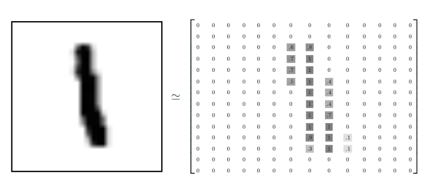

**one-hot编码**

```python
f.one_hot(indices, depth, on_value=None, off_value=None, axis=None, dtype=None, name=None)
```

- indices 在独热编码中位置，即数据集标签
- depth 张量的深度，即类别数

**SoftMax回归**

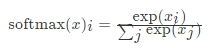

在神经网络中，整个过程如下：

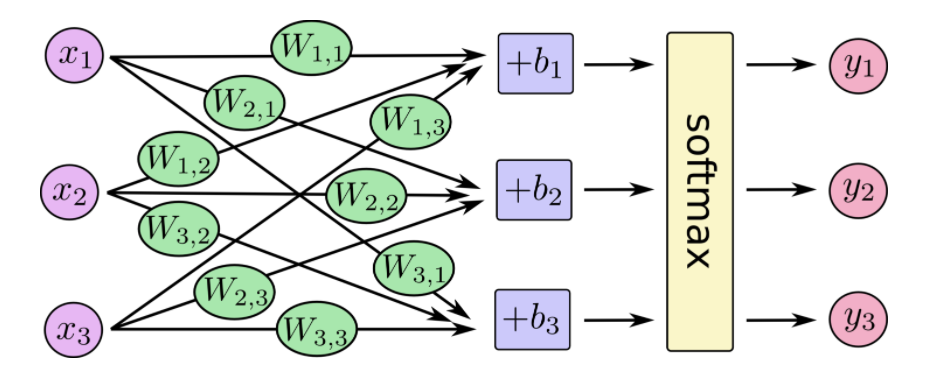

也就是最后的softmax模型，用数学式子表示

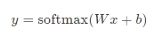

**损失计算-交叉熵损失**

确定模型损失的一个非常常见的非常好的功能称为“交叉熵”。交叉熵来源于对信息理论中的信息压缩代码的思考，但是从赌博到机器学习在很多领域都是一个重要的思想。它定义为

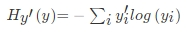

它表示的是目标标签值与经过权值求和过后的对应类别输出值

```python
tf.nn.softmax_cross_entropy_with_logits

tf.nn.softmax_cross_entropy_with_logits(_sentinel=None, labels=None, logits=None, dim=-1, name=None)
```

计算logits与labels之间的softmax交叉熵损失，该函数已经包含了softmax功能，logits和labels必须有相同的形状[batch_size, num_classes]和相同的类型(float16, float32, or float64)。

- labels 独热编码过的标签值
- logits 没有log调用过的输入值
- 返回 交叉熵损失列表

```
tf.nn.softmax_cross_entropy_with_logits(labels=y_label, logits=y))
```

### 四、实现神经网络模型

**获取参数**

tensorflow提供给我们下载mnist数据集的接口，需要指定下载目录

```python
from tensorflow.examples.tutorials.mnist import input_data
# 输入数据
mnist = input_data.read_data_sets(FLAGS.data_dir, one_hot=True)
```

**计算数据**

需要生成权重和偏置初始值，为了随时能够接受输入值，需要构造输入占位符

```python
# 建立输入数据占位符
x = tf.placeholder(tf.float32, [None, 784])

#初始化权重和偏置
W = tf.Variable(tf.zeros([784, 10]))
b = tf.Variable(tf.zeros([10]))

# 输出结果
y = tf.matmul(x, W) + b
```

**梯度下降优化与训练**

TensorFlow知道计算的整个图形，它可以**自动**使用反向传播算法来有效地确定变量如何影响您要求最小化的损失。它可以应用您选择的优化算法来修改变量并减少损失。

```
train_step = tf.train.GradientDescentOptimizer(0.5).minimize(cross_entropy)
```

每次提供一部分值，然后多次进行训练train_step，使之不断的更新

```python
# 训练
for i in range(1000):
    print("第%d次训练"%(i))
    batch_xs, batch_ys = mnist.train.next_batch(100)
    sess.run(train_step, feed_dict={x: batch_xs, y_label: batch_ys})
```

**模型正确率评估**

使用tf.argmax，这是一个非常有用的功能，它给出沿某个轴的张量中最高条目的索引

```
correct_prediction = tf.equal(tf.argmax(y, 1), tf.argmax(y_label, 1))
```

然后这给了我们一个布尔的列表。为了确定哪个部分是正确的，我们转换为浮点数，然后取平均值。例如， [True, False, True, True]会变成[1,0,1,1]哪一个0.75

```
accuracy = tf.reduce_mean(tf.cast(correct_prediction, tf.float32))
```

**跟踪变量**

同时为了在tensorboard更好的观察变量的变化，我们去进行节点汇总操作,我们观察损失、准确率以及高维变量WW的变化

```python
tf.summary.scalar("loss",cross_entropy)
tf.summary.scalar("accuracy", accuracy)
tf.summary.histogram("W",W)
```

### 五、简单的单层神经网络预测手写数字图片

见代码部分