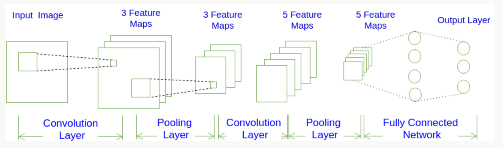
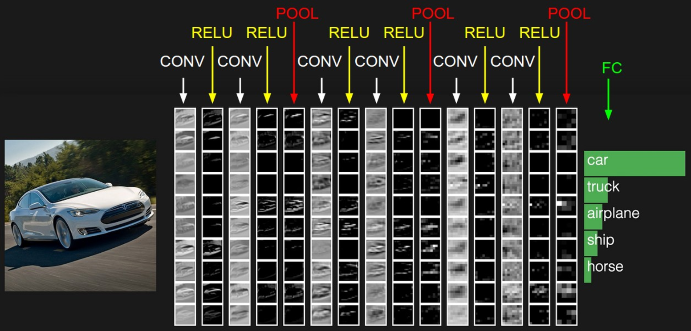
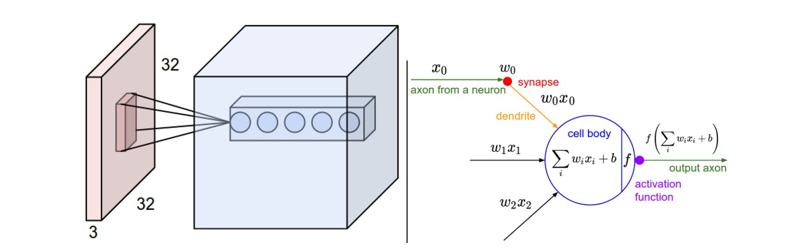

### 一、卷积分神经网络和卷积层结构

卷积神经网络(Convolutional Neural Network, CNN)。说卷积神经网络是最重要的一种神经网络也不为过，它在最近几年大放异彩，几乎所有图像、语音识别领域的重要突破都是卷积神经网络取得的，比如谷歌的GoogleNet、微软的ResNet等，打败李世石的AlphaGo也用到了这种网络。

由具有学习权重和偏差的神经元组成。每个神经元接收一些输入，执行点积，并且可选地以非线性跟随它。整个网络仍然表现出单一的可微分评分功能：从一端的原始图像像素到另一个类的分数。并且在最后（完全连接）层上它们仍然具有损失函数（例如SVM / Softmax），并且我们为学习正常神经网络开发的所有技巧/技巧仍然适用。

CNN每一层都通过可微分的函数将一个激活的值转换为另一个，一般来说CNN具有卷积层，池化层和完全连接层FC（正如在常规神经网络中所见）,在池化层之前一般会有个激活函数，我们将堆叠这些层，形成一个完整的架构。我们先看下大概的一个图：





CNN它将一个输入3D体积变换为输出3D体积，正常的神经网络不同，CNN具有三维排列的神经元：宽度，高度，深度。


**卷积分**



**参数及结构**

四个超参数控制输出体积的大小：过滤器大小，深度，步幅和零填充。得到的每一个深度也叫一个Feature Map。

### 二、卷积层激活层与池化层

**卷积层**

| 参数及结构    | 过滤器大小，深度，步幅和零填充         |
| -------- | ----------------------- |
| 卷积层的处理   | 过滤器大小（需要自己指定）           |
| 卷积层的输出深度 | 输出深度是由你本次卷积中Filter的个数决定 |
| 卷积层的输出宽度 | 输出宽度可以通过特定算数公式进行得出      |


### 三、面试题分析

见csdn

### 四、卷积神经网络识别手写数字

Mnist数据集可以从官网下载，网址： **http://yann.lecun.com/exdb/mnist/** 下载下来的数据集被分成两部分：55000行的训练数据集（mnist.train）和10000行的测试数据集（mnist.test）。每一个MNIST数据单元有两部分组成：一张包含手写数字的图片和一个对应的标签。我们把这些图片设为“xs”，把这些标签设为“ys”。训练数据集和测试数据集都包含xs和ys，比如训练数据集的图片是 mnist.train.images ，训练数据集的标签是 mnist.train.labels。

**初始化卷积层权重**

```python
def weight_variable(shape):
  initial = tf.truncated_normal(shape, stddev=0.1)
  return tf.Variable(initial)

def bias_variable(shape):
  initial = tf.constant(0.1, shape=shape)
  return tf.Variable(initial)
```

**卷积和池化**

`tf.nn.conv2d(input, filter, strides, padding, use_cudnn_on_gpu=None, name=None)`

| 参数               | 说明                                  |
| ---------------- | ----------------------------------- |
| input            | A Tensor。必须是以下类型之一：float32，float64。 |
| filter           | A Tensor。必须有相同的类型input。             |
| strides          | 列表ints。1-D长度4.每个尺寸的滑动窗口的步幅input。    |
| padding          | string来自："SAME", "VALID"。使用的填充算法的类型 |
| use_cudnn_on_gpu | 可选bool。默认为True。                     |
| name             | 操作的名称（可选）。                          |

`f.nn.max_pool(value, ksize, strides, padding, name=None)`

| 参数      | 说明                                       |
| ------- | ---------------------------------------- |
| value   | 4-D Tensor具有形状[batch, height, width, channels]和类型float32，float64，qint8，quint8，qint32 |
| ksize   | 长度> = 4的int列表。输入张量的每个维度的窗口大小。            |
| strides | 长度> = 4的int列表。输入张量的每个维度的滑动窗口的跨度。         |
| padding | 一个字符串，或者'VALID'或'SAME'。填补算法。             |
| name    | 操作的可选名称。                                 |

TensorFlow在卷积和池化上有很强的灵活性。我们使用步长为2，1个零填充边距的模版。池化选择2*2大小。

```python
def conv2d(x, W):
  return tf.nn.conv2d(x, W, strides=[1, 1, 1, 1], padding='SAME')

def max_pool_2x2(x):
  return tf.nn.max_pool(x, ksize=[1, 2, 2, 1],
                        strides=[1, 2, 2, 1], padding='SAME')
```